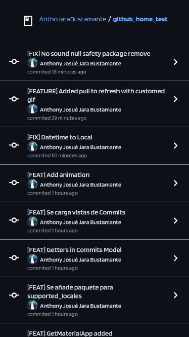

# Live preview Flutter Web

[#Live Preview](https://github-home-test.netlify.app/)

A commit-based version control system for GitHub Flutter proyect.

## Getting Started

This project is a starting point for a Flutter application.

A few resources to get you started if this is your first Flutter project:

- [Lab: Write your first Flutter app](https://flutter.dev/docs/get-started/codelab)

For help getting started with Flutter, view our
[online documentation](https://flutter.dev/docs), which offers tutorials,
samples, guidance on mobile development, and a full API reference.

## How to run the Project

Once the latest Flutter version has been installed, type the following command lines in the Project root folder:

-To update the project: `flutter update`

-To run the project: `flutter run`

## Screenshots

